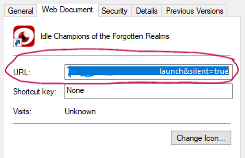

# ICC

Used to grab Idle Champions Codes and enter them into Epics Idle Champions!

## Project Description

I got a little tired of constantly going to a website grabbing codes and doing them manually, so here we go. Its a fun little project that uses OCR but there are a few key steps to allow it to work correctly. I'll do my best to walk you through your first time process. After that you should be all set!

    ** This is not for playing the game, ONLY entering unlock chest codes. A few other notes, This is dependent on being in and adventure, ones that are not completed, and not being 200+ deep into them.(Load times vary) Entering inputs is partly based off of delay's and this can greatly effect its success.

## Getting Started

    ** The first time this is ran is the longest as all combos are set to False but there is a way to run faster, by setting True in step 3. Depends if you have a GPU capable.

### STEP 1:
Open the game, go into Settings than to Display and set resolution to 1280x720, making sure to check force 16:9 and UI Scale to 100%. This is massively important!! Please do not skip this step otherwise your going to cry that it does not work.

### STEP 2:
Go into ICC/assets and youll find a .env file, in that file youll add your URL. To find the games url, this can be done by opening the properties of the Idle Champions shortcut and going under Web Document:

  

    ** Dont worry if you dont see ICC/assets when cloning the git, the directory and files are created dynamically and because of this the first time it is ran will raise an error.

### STEP 3:
This is if you have a GPU capable of being used for OCR, back in the same .env file you'll find a line GPU_ON and can just type True otherwise itll be False by default.

### Dependencies

- beautifulsoup4==4.12.3
- PyGetWindow==0.0.9
- pynput==1.7.7
- pyperclip==1.9.0
- requests==2.32.3

And more, check requirements.txt for a full list.

### Install

~~~
git clone https://github.com/teslonobo/ICC.git
~~~

Once you create a virtual environment, and activate it:

~~~
pip install -r requirements.txt
~~~

This may take a moment, as tensorflow and other dependencies install.

### Execute Instructions

Once you have set it up, launch a terminal from directory you added this project into and call:

~~~
python ICC
~~~

## Help Support

For help and support, you can reach out to me via GitHub Issues.

## RoadMap

- Making it more efficient, especially during first load, it will error out because no URL is added

## Authors

Teslonobo

## Version History

- 0.1
    - Initial release

## License

This project is licensed under the MIT License - see the LICENSE file for details.

## Acknowledgments

[Incendar](https://incendar.com/idlechampions_codes.php)

## Final Thoughts

Ive learned alot, I mean every project you learn something you didnt but this one helped solidify what I do know. Oh also getting better at reading Documentation!